# Задание 1

---

## Критические баги - P0

1. Отсутствие чекбокса с выбором породы под полем "Порода" в фильтре

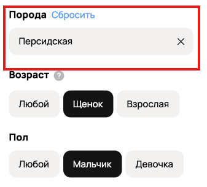

2. Отсутсвует поле "Окрас" между фильтрами "Пол" и "Возраст"

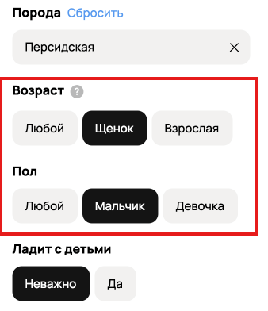

---

## Баги с высоким приоритетом - P1

1. Найденные объявления не соответствуют заданным фильтрам

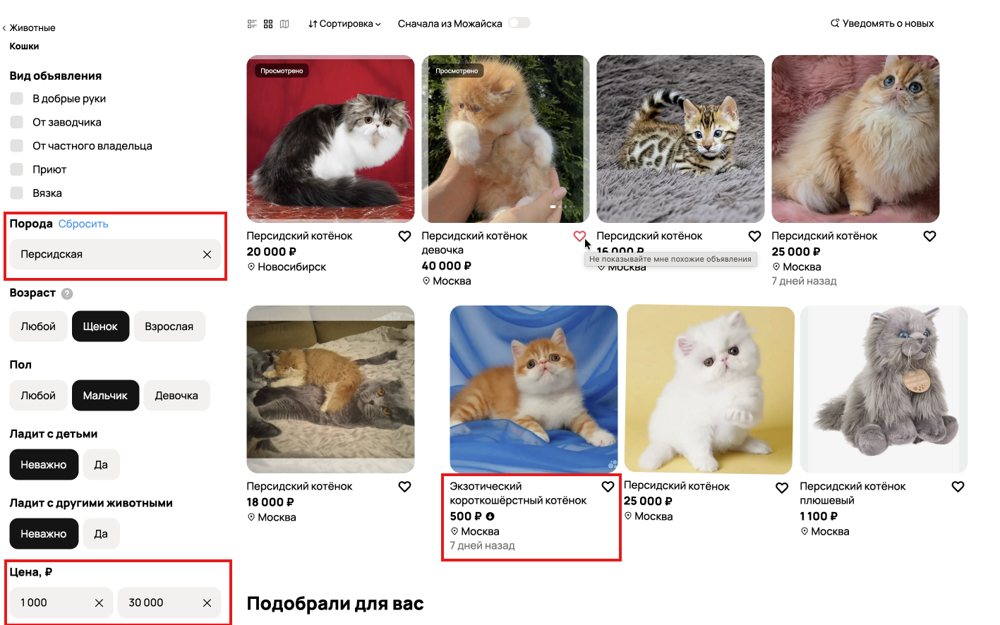

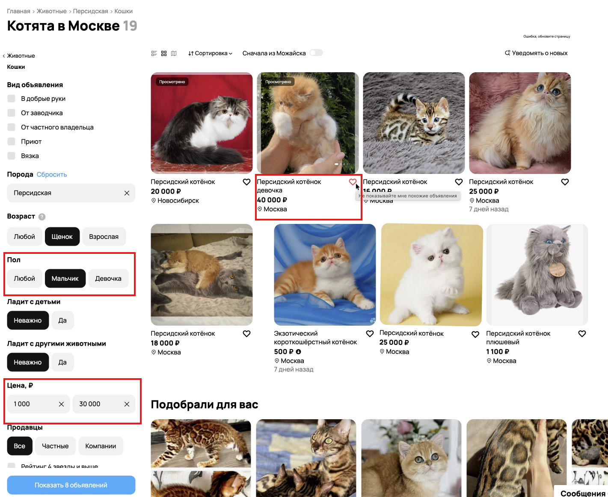

2. В результате выдаёт объявления из Новосибирска

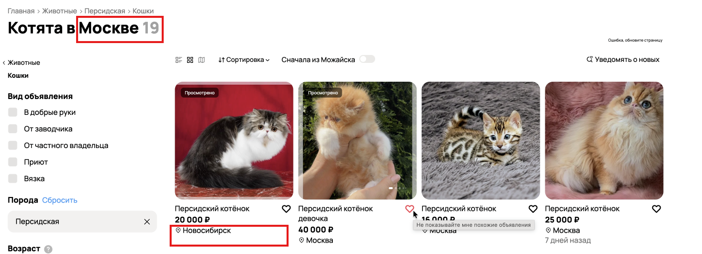
3. Объявления находятся в неверной категории

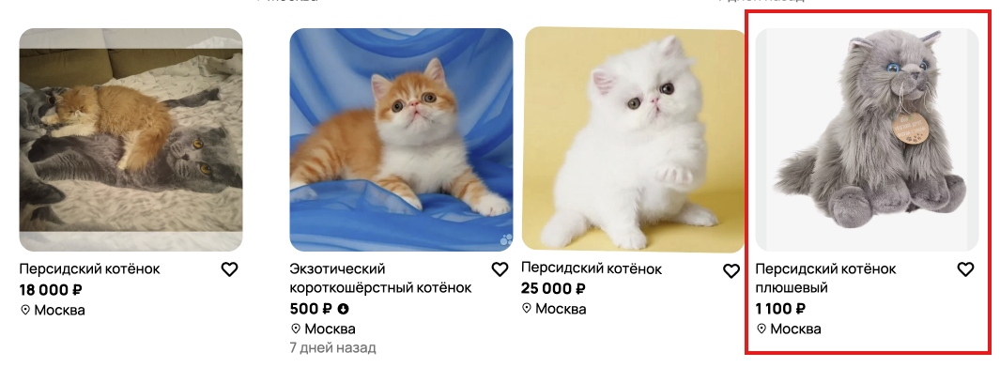
На изображении представлен не персидский котёнок

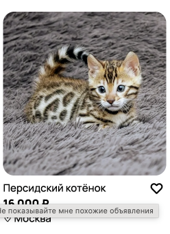

4. Текст о неизвестной ошибке на продакшене

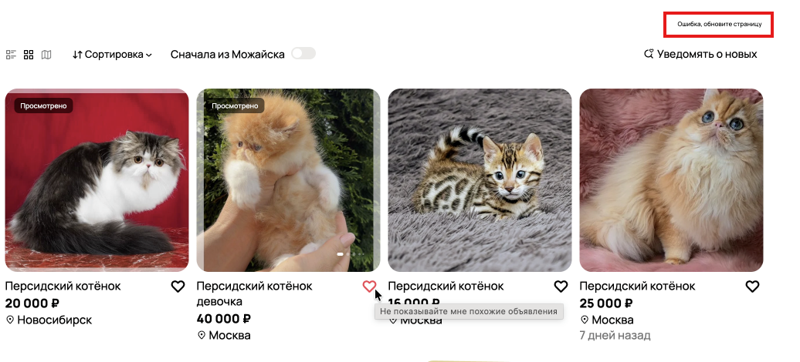

---

## Баги со средним приоритетом - P2

1. Разные отступы между плитками объявлений

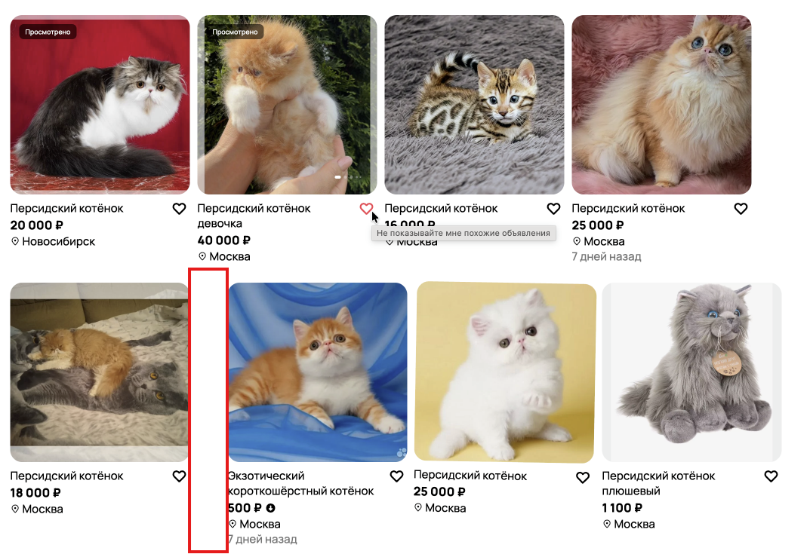

2. Несоответствие количества объявлений в фильтре и заголовке

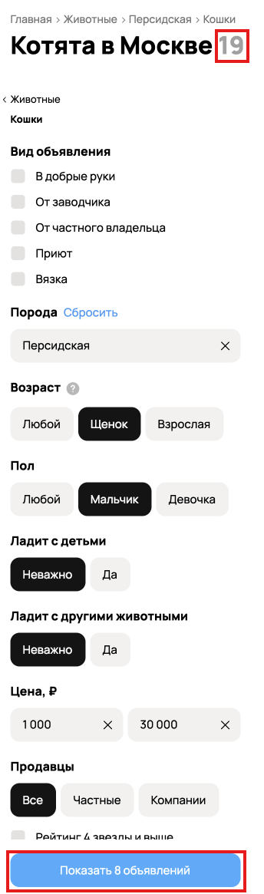

3. Неподходящий фильтр в категории "Животные - кошки"

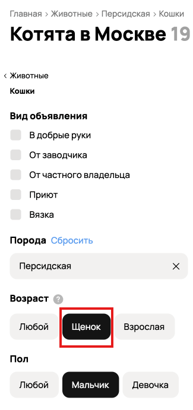

4. Неверно указано расположение в переключателе (Тоггле) объявлений из текущего города 

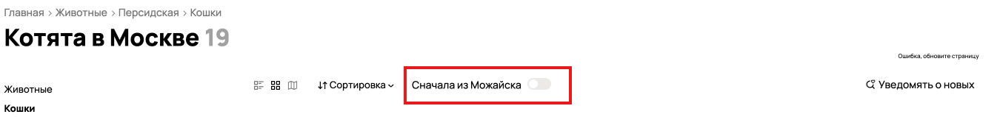

---

## Баги с низким приоритетом - P3

1. Неверный текст всплывающей подсказки (тултипа) у кнопки "Добавить в избранное"

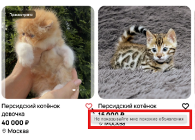

2. Неверно указан порядок элементов навигации в "хлебных крошках"

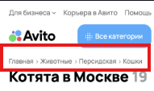

3. Грамматическая ошибка в шапке (Хэдере) в кнопке "Карьера в Авито"

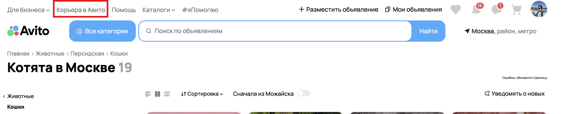

---

